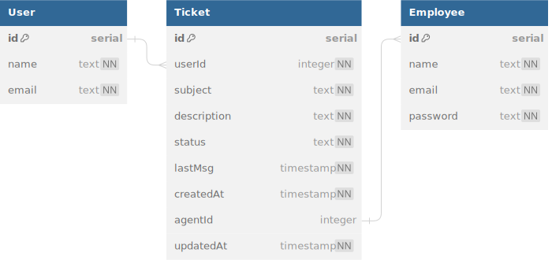

<p align="center">A basic <a href="https://ag-help-desk.vercel.app/">help desk</a> app with ticket submission and panel view capabilities.</p>
<p align="center">Built with <a href="https://github.com/vercel/nextjs-postgres-auth-starter">Next.js-Prisma-PostgreSQL Starter</a>.</p>

<p align="center">
  <a href="https://www.typescriptlang.org/">
    
  </a>
  <a href="https://developer.mozilla.org/en-US/">
    
  </a>
  <a href="https://react.dev/">
    
  </a>
  <a href="https://nextjs.org/">
    
  </a>
  <a href="https://tailwindcss.com/">
    
  </a>
  <a href="https://www.prisma.io/">
    
  </a>
  <a href="https://www.postgresql.org/">
    
  </a>
  <a href="https://vercel.com/">
    
  </a>
</p>

## Features

- Submit ticket requests
- View all tickets and related details in admin panel
- Periodic refresh of admin panel to retrieve new tickets
- Update ticket status
- Respond to a ticket

## REST APIs

- submit-request(name, email, subject, description)
- update-ticket(ticketId, field, updatedValue)
- view-tickets()

## Database Design (Postgres)



<p align="right">(<a href="#readme-top">back to top</a>)</p>

## Getting Started

**Create .env file variables:**

```base
DB_URL="_insert url to postgres database here_"
NODE_ENV="development"
```

Cloud-hosted database tool recommendation: [Railway](https://railway.app/). With Railway, an empty database (and SHADOW_DB_URL) isn't necessary to enable development-focused Prisma commands. See [shadow database](https://www.prisma.io/docs/concepts/components/prisma-migrate/shadow-database) for more info on their role in detecting potential schema issues - by comparing existing migrations to the development branch - prior to generating a new migration.

**Install packages:**

```bash
npm install
```

**Run the development server:**

```bash
npm run dev
```

Open [http://localhost:3000](http://localhost:3000) with your browser to see the app.

<p align="right">(<a href="#readme-top">back to top</a>)</p>

## Roadmap

- [ ] Update the agent assigned to a ticket
- [ ] Update the last message date when agents respond to a ticket
- [ ] Add auth to restrict access to admin panel
- [ ] Implement rate limiter for ticket submissions
- [ ] Create UI and database functionality tests

<p align="right">(<a href="#readme-top">back to top</a>)</p>

## Acknowledgements

- [Skill Icons](https://skillicons.dev)
- [DB Diagram](https://dbdiagram.io/)